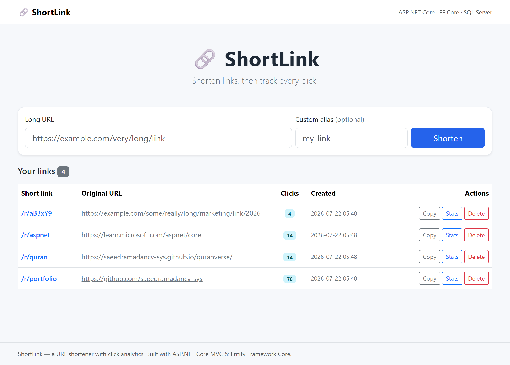
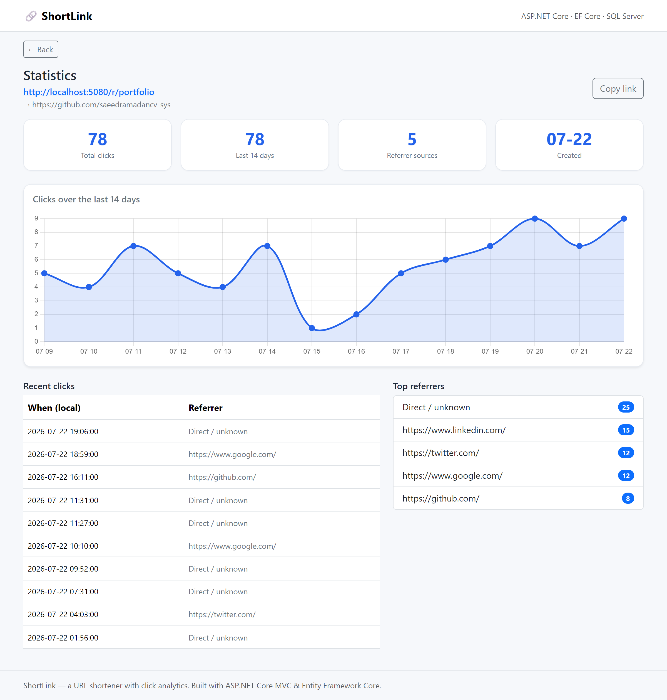

<h1 align="center">🔗 ShortLink — URL Shortener with Click Analytics</h1>

<p align="center">
  A full-stack URL shortener built with <b>ASP.NET Core MVC</b>, <b>Entity Framework Core</b>, and <b>SQL Server</b>.<br/>
  Shorten a link, share it, and track every click — with a per-link analytics dashboard.
</p>

<p align="center">
  <a href="https://url-shortener-cc59.onrender.com/"></a>
</p>

<p align="center"><sub>Hosted free on Render — the first request after idle may take ~30s to wake up.</sub></p>

<p align="center">
  
  
  
  
  
</p>

---

## Features

- **Shorten any URL** with an auto-generated code, or a **custom alias**.
- **Click tracking** — every visit records a timestamp, referrer, and user agent.
- **Analytics dashboard per link** — total clicks, a 14-day clicks chart (Chart.js), recent clicks, and top referrers.
- **Copy-to-clipboard**, delete, and a live list of all your links with click counts.
- **Server-side validation** (valid http/https URLs, alias format and uniqueness) and **anti-forgery protection** on every form.
- **Provider-agnostic data layer**: SQL Server by default, or SQLite for zero-setup local runs.

---

## Screenshots

<p align="center">
  
  <br/><em>Home — shorten a URL and see all your links with click counts</em>
</p>

<p align="center">
  
  <br/><em>Analytics — clicks over 14 days, recent clicks, and top referrers</em>
</p>

---

## Tech stack

| Layer     | Technology                                   |
|-----------|----------------------------------------------|
| Framework | ASP.NET Core MVC (.NET 9)                    |
| Data      | Entity Framework Core (SQL Server / SQLite)  |
| Database  | SQL Server (LocalDB) by default              |
| Frontend  | Razor views, Bootstrap 5, Chart.js           |
| Language  | C#                                           |

---

## Getting started

### Prerequisites
- [.NET SDK 9](https://dotnet.microsoft.com/download)
- SQL Server or SQL Server **LocalDB** (bundled with Visual Studio). *Not needed if you run with SQLite — see below.*

### Run with SQL Server (default)
The connection string is in `appsettings.json` (`ConnectionStrings:SqlServer`, defaults to LocalDB). Then:

```bash
dotnet run
```

The database and tables are created automatically on first run. Open the URL shown in the console.

### Run without SQL Server (SQLite)
No database engine required — the app creates a local `urlshortener.db` file:

```bash
dotnet run --UseSqlite=true
```

### Load demo data (optional)
Seed a few links and sample click history for a populated dashboard:

```bash
dotnet run --UseSqlite=true --Seed=true
```

---

## How it works

1. **Create** — `POST /Home/Create` validates the URL, generates a unique 6-character code (or uses your alias), and stores a `ShortUrl` row.
2. **Redirect** — `GET /r/{code}` looks up the code, records a `Click` (timestamp, referrer, user agent), then 302-redirects to the original URL.
3. **Analytics** — `GET /Home/Details/{id}` aggregates the click history into a 14-day series, recent clicks, and top referrers.

### Data model

```
ShortUrl (Id, Code [unique], OriginalUrl, CreatedAt)
    └── Click (Id, ShortUrlId, ClickedAt, Referrer, UserAgent)   // cascade delete
```

---

## Engineering notes

The interesting parts of this project aren't the CRUD — they're the decisions underneath it.

### Short codes are generated securely, not conveniently

The obvious way to generate a short code is `Random`. Two problems: `Random` is a
pseudo-random generator seeded from the clock (codes become predictable, so anyone could
enumerate other people's links), and codes get read off screens by hand, where `0/O` and
`1/l/I` are genuinely hard to tell apart. So the generator uses
`RandomNumberGenerator.GetBytes()` (cryptographically secure) over a **56-character
alphabet with the ambiguous glyphs removed**:

```csharp
private const string Alphabet = "abcdefghijkmnopqrstuvwxyzABCDEFGHJKLMNPQRSTUVWXYZ23456789";
```

And because uniqueness is a *database* guarantee, not an application one, the `Code`
column carries a unique index — the generator retries on collision rather than assuming
it won't happen.

### The database provider is a runtime decision, not a compile-time one

`Program.cs` picks the EF Core provider from configuration, so it's SQL Server in
production and SQLite for a zero-setup local run — with **no code changes**. Reviewing
this repo does not require installing SQL Server.

### Every write path is hardened

| Risk | Mitigation |
|---|---|
| Cross-site request forgery | `[ValidateAntiForgeryToken]` on every POST action |
| `javascript:` / `data:` URL injection | Server-side scheme allow-list — only `http` / `https` |
| Malicious custom aliases | Regex-constrained to `^[A-Za-z0-9_-]{3,32}$` |
| Alias squatting | Uniqueness checked before insert, unique index behind it |
| Oversized `User-Agent` | Truncated to 400 characters before storage |

### Async end to end, reproducible deploys

Every database call uses the EF Core async APIs so request threads never block on I/O, and
cascade delete is configured with the Fluent API. A multi-stage `Dockerfile` ships only the
runtime image, `render.yaml` describes the service as Infrastructure-as-Code, and the app
binds to the host's injected `$PORT` — the same image runs locally and in the cloud.

---

## Project structure

```
UrlShortener/
├── Controllers/HomeController.cs   # create, redirect, stats, delete
├── Data/AppDbContext.cs            # EF Core context + model config
├── Data/DemoSeeder.cs             # optional demo data (runs only with --Seed=true)
├── Models/                         # ShortUrl, Click, StatsViewModel
├── Views/Home/                     # Index (list + form), Details (analytics)
├── wwwroot/css/site.css            # custom styling
├── appsettings.json                # connection strings + provider switch
└── Program.cs                      # DI, provider selection, routing
```

---

---

## License

MIT — see [LICENSE](LICENSE).

---

**Saeed Adel Ramadan** — Junior .NET Developer, Amman, Jordan
[GitHub](https://github.com/saeedramadancv-sys) · [LinkedIn](https://linkedin.com/in/saeed-ramadan-cv) · saeed.ramadan.cv@gmail.com
